# Capsule

[](https://github.com/vorgtrom/capsule-notch/actions/workflows/build.yml)

A little glass capsule that sits on the edge of your Windows screen.

It shows how much of your **Claude Code** and **Codex** usage limits you've used, and whether a Claude Code
session is **working** or **waiting on you**. With **Google Calendar** connected, it also shows when your next
event starts. Click it, or press **Ctrl+Alt+N** anywhere, for the full panel: your usage, your sessions, today's
and tomorrow's events and tasks, a month calendar where you add, edit and delete them, and a box to jot down an
idea that lands in **Notion**. And when Claude asks for
permission or asks you a question, you can **approve it or answer it right on the capsule**, without switching
to the Claude app. It's built to grow: each of these is a module, and more will follow.

| On the screen edge | Hover a ring | Click it |
|:---:|:---:|:---:|
| 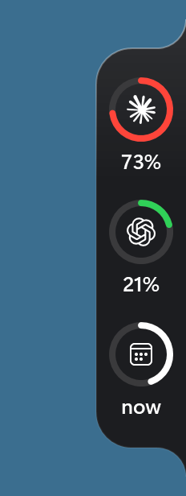 | 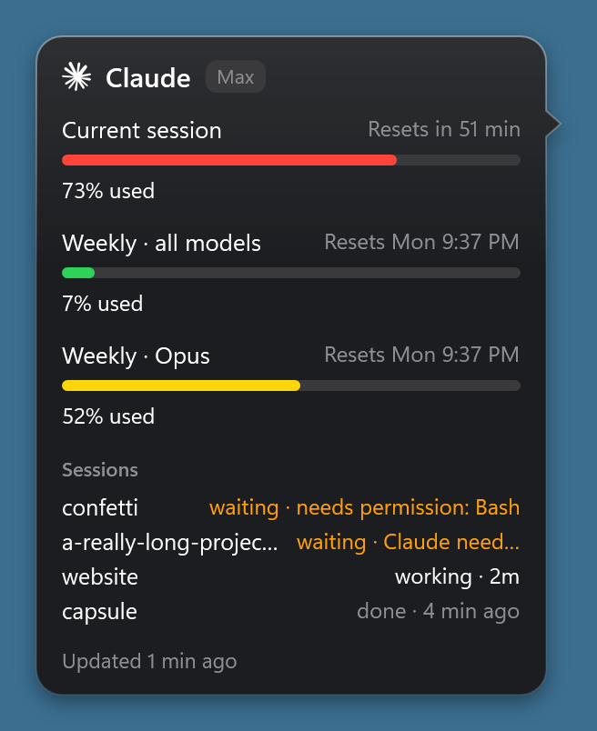 | 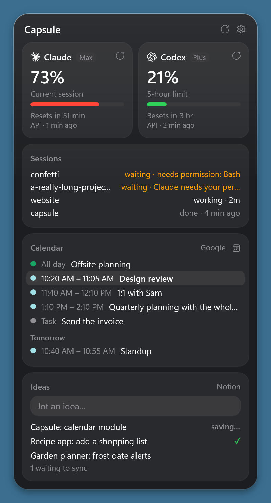 |

*The pictures here and below show the solid look. On Windows 11 the glass is clear, with the windows behind it blurred live.*

## What it shows

- **One ring per tool.** It shows how much of the current limit you've used: green under 50%, yellow from
  50%, red from 70%.
- **Hover a ring** for every limit, when each resets, and your live Claude Code sessions.
- **While Claude works**, a small white arc spins inside its ring. Codex's ring spins too while a Codex turn runs. Codex has no "waiting on you" signal, so its ring never pulses.
- **While Claude waits on you**, for example with a question or a permission prompt, the whole ring pulses
  amber.
- **Approve or answer Claude from the capsule**: see [below](#approve-and-answer-claude-from-the-capsule).
- **Your calendar**, once you [connect Google Calendar](#google-calendar) (a one-minute paste): a third cell under Claude and Codex.
  - It shows when your next event today starts ("2:30", or "14:30" with a 24-hour clock).
  - During an event it shows **now**, and its ring fills as the event runs.
  - It shows **—** when nothing is left today.
  - Hover it for the rest of today and tomorrow's first three events, and, signed in, the Google Tasks due on those
    days that aren't done.
  - All-day events, cancelled ones and ones you declined don't count for the cell.
- **Click the capsule** for the panel: a tile each for Claude and Codex, your sessions, your calendar, and your ideas.
  Signed in with your own client, the Calendar tile also lists today's and tomorrow's Google Tasks that aren't done.
- **A month at a glance**: the Calendar tile's calendar button opens the [month page](#the-month-page). Click a day for
  its events and tasks, and add, edit or delete one.

| Hover the calendar | The month page |
|:---:|:---:|
| 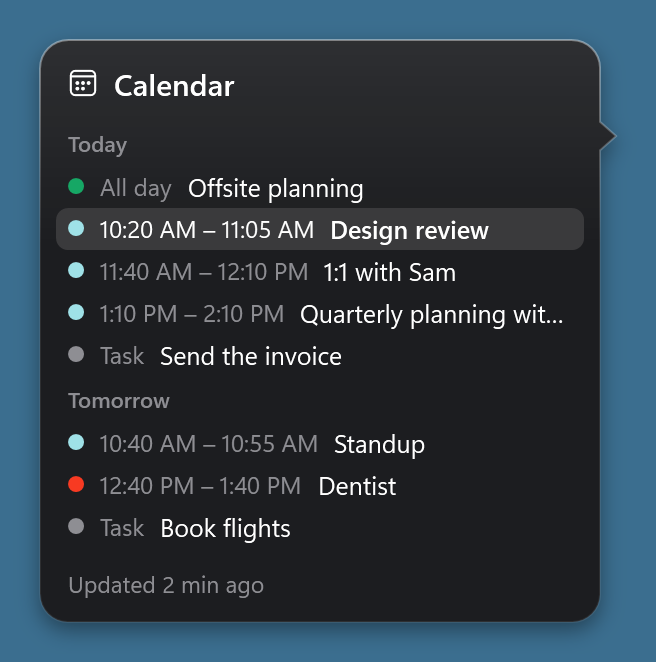 | 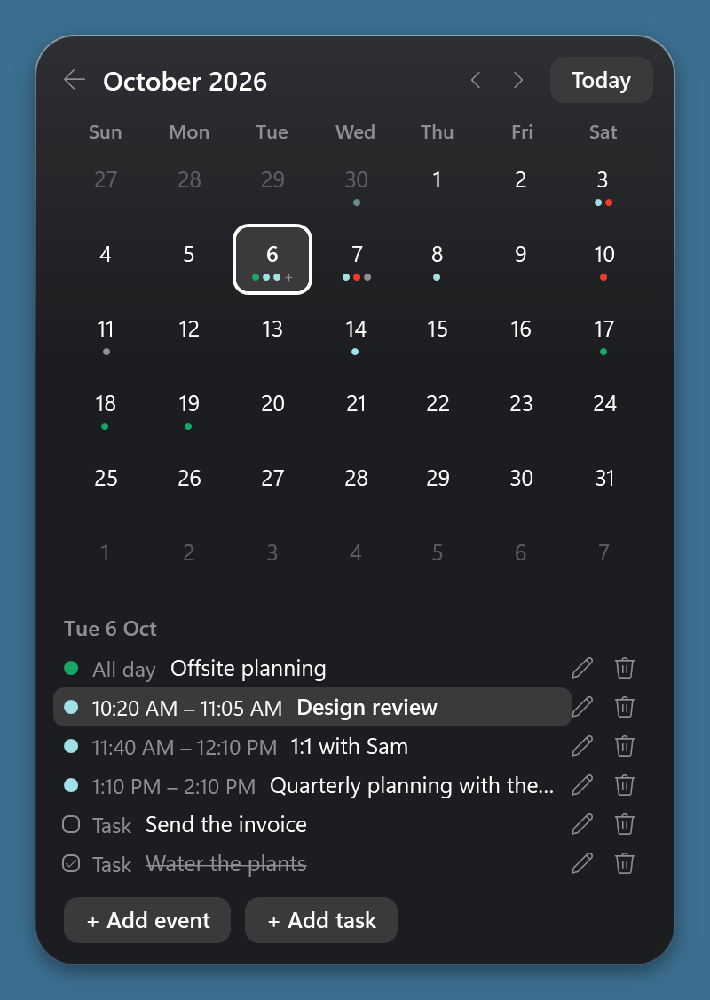 |

| Working | Waiting on you |
|:---:|:---:|
| 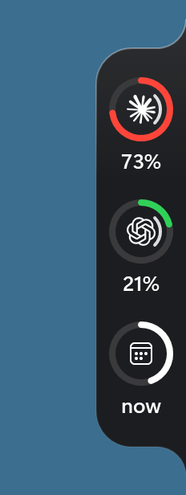 | 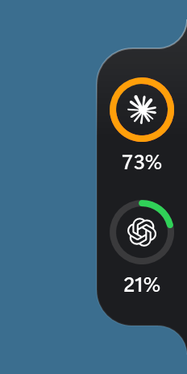 |

## Approve and answer Claude from the capsule

When Claude Code needs you while you're in another app, you don't have to switch back to the Claude app.
Claude's ring pulses amber; **hover it**, and the card shows what Claude is asking:

- **A command permission prompt** ("Claude wants to run a command"): what it wants to run, and
  **Allow**, **Always allow**, **Deny** or **Answer in Claude**. **Always allow** only appears when Claude
  Code itself suggests a rule that Capsule can show completely. Hover the command or **Always allow** to read
  its full text in a scrollable tooltip. The command tooltip preserves spaces and line breaks.
- **A question**: Claude's options as buttons (checkboxes when you can pick several), one question at a
  time, with **Other…** to type your own answer, then **Next** or **Send**.
- **File edits, plans, and other tools** stay in Claude's normal approval prompt until Capsule has a full preview.
  Commands over 4,000 characters, or commands with hidden control characters, also stay in Claude.

| Approve a command | Answer a question |
|:---:|:---:|
| 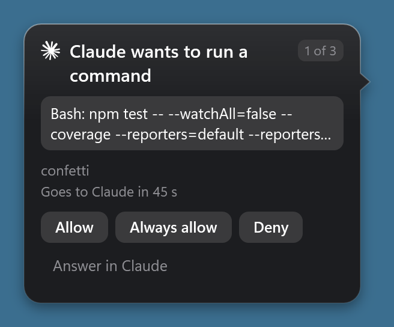 | 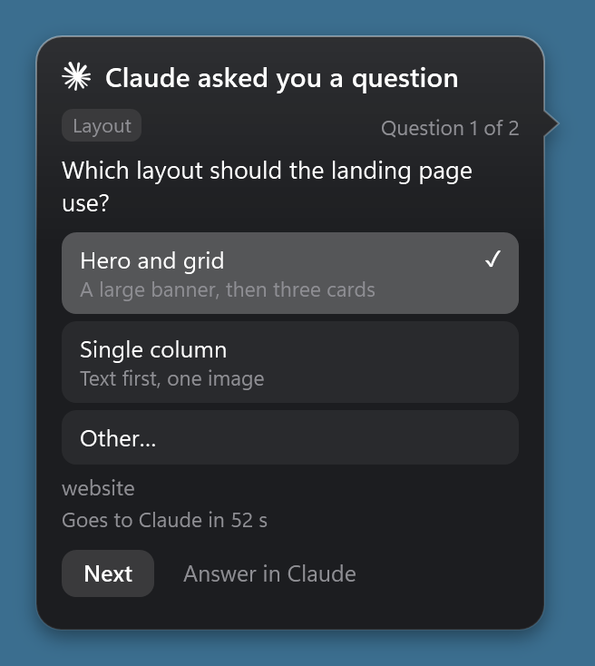 |

- **Nothing gets stuck.** Untouched, a request goes to the Claude app after 60 s, as if Capsule weren't there.
  Using the card restarts that, but never past 80 s after the request arrived, because Claude Code's hook
  only waits 90 s.
- **It stays out of your way.** While the Claude app's window is in front, or the capsule is hidden, the app
  asks as usual. Capsule also lets go as soon as the app's own prompt is answered.
- **Several requests** wait their turn, oldest first ("1 of 3").
- It needs **Connect to Claude Code** (see [Use](#use)); if you connected with an older Capsule, choose
  **Reconnect to Claude Code** once.

On Windows 11 the capsule, its cards and the panel are clear glass, with the windows behind them blurred
live. They follow Windows' light or dark mode. With **Transparency effects** off in Windows' settings, or on
Windows 10, they're solid glass instead.

[Download a release](#get-it), or build it yourself: `build.cmd` compiles it with the C# compiler that ships with
Windows, so nothing is downloaded and nothing unsigned from the internet runs.

## Get it

You need Windows 10 or 11 (64-bit) with .NET Framework 4.8 or later, which Windows 11 and an up-to-date Windows 10
have already.

**Download it (no building):**
1. On the [Releases page](https://github.com/vorgtrom/capsule-notch/releases/latest), download `Capsule-<version>.zip`.
2. Unzip it into a folder that stays, such as `Documents\Capsule`. Start with Windows and Connect to Claude Code point
   at that folder, so don't run it from Downloads or from inside the zip.
3. Start `Capsule.exe`.
   - Capsule isn't code-signed, so Windows may say **Windows protected your PC**. Click **More info**, then **Run
     anyway**. Each release is built and tested by GitHub from the code in this repo; the zip's SHA-256 is next to it.
   - If your antivirus objects, see [Antivirus](#antivirus).

**Or build it yourself.** In PowerShell:

```powershell
git clone https://github.com/vorgtrom/capsule-notch.git
cd capsule-notch
.\build.cmd
.\bin\Capsule.exe
```

No Git? Click **Code → Download ZIP** on this page, unzip it somewhere that stays (your Desktop or Documents, say),
and run `build.cmd` in that folder. `build.cmd` should end with `Build OK`; then start `bin\Capsule.exe`.

## Build

Run `build.cmd`.
- It compiles `bin\Capsule.exe`, `bin\capsule-hook.exe` and `bin\Tests.exe` with
  `%WINDIR%\Microsoft.NET\Framework64\v4.0.30319\csc.exe`, then runs the tests.
- It stops a running copy first.
- Run it again after any change.

GitHub builds and tests every pull request and every change to `main` the same way, on Windows, so a change that
breaks the build or a test shows a red ✗ there before it's merged.

To see how many checks each group of tests ran, run `bin\Tests.exe --groups` after a build.

To try a change while Capsule is running, run `build.cmd dev` instead. It builds into `bin-dev\`, runs the
tests there, and leaves a running Capsule alone.

### Update to the latest version

**If you downloaded a release:** once a day it checks whether a newer one is out. When one is, a balloon says so and
the menu's first item reads **Capsule v1.2.0 is available…**; choose it for the release's page. Then quit Capsule
(right-click it → **Quit Capsule**), download the new zip, unzip it over the same folder, and start `Capsule.exe`
again. Your settings carry over, as below. To stop the daily check, untick **Check for updates** in the menu.

**If you built it:**

1. Get the latest code in this folder:
   - **The released version:** `git checkout main`, then `git pull`.
   - **A change that isn't merged yet,** to try it first: `git fetch origin`, then `git checkout <its branch>`. Go back
     with `git checkout main`.
   - **If you downloaded a ZIP** instead of cloning, download the new one and copy its files over this folder's. Keep
     the folder where it is.
2. Optionally, run `build.cmd dev` first. It builds into `bin-dev\` and runs the tests while your Capsule keeps
   running. It should end with `Build OK`. If it says `BUILD FAILED`, stop here: your Capsule is untouched.
3. Run `build.cmd`. It quits the running Capsule, builds into `bin\` and runs the tests. It should end with `Build OK`.
   If it says `BUILD FAILED` instead, go back with `git checkout main` and run `build.cmd` again.
4. Start `bin\Capsule.exe`.

What carries over:
- **Your settings, sign-ins and ideas** are in `%USERPROFILE%\.capsule\`, which a build never touches.
- **Start with Windows and Connect to Claude Code** both point at `bin\`, so they keep working.
- **If a new version changes the hook,** the menu says **Reconnect to Claude Code**; choose it once.

Only one Capsule runs at a time. `bin-dev\Capsule.exe` quits at once while `bin\Capsule.exe` runs, so `build.cmd dev` is
for running the tests (and `--preview`) without stopping the running copy, not for running a second one.

### Antivirus

Behaviour-based antivirus may freeze or remove Capsule. It's a brand-new unsigned program that reads the
Claude and Codex sign-in files, keeps an encrypted Notion secret and Google sign-in, and goes online, which is also what
token-stealing malware does. Norton did this on the first run.

If it happens to you:
1. Restore `Capsule.exe` from the antivirus's history.
2. Exclude the folder Capsule runs from: the one you unzipped it into, or `bin` if you built it. In Norton: **Settings → Antivirus → Scans and Risks → Items to Exclude from
   Auto-Protect, Script Control, SONAR and Download Intelligence Detection**.

Only exclusions survive updates and rebuilds. All the source is in this repo, so you can check what it does first.

## Use

Start `Capsule.exe`: in the folder you unzipped it into, or `bin\Capsule.exe` if you built it. The first time, it
adds itself to Start with Windows. You can turn that off in the menu.

- **Hover** a ring to see the details.
- **Click** the capsule for the panel. Its ⟳ buttons check again now. If Claude needs signing in, its tile
  has a **Sign in** button, which runs `claude auth login`.
- **Ctrl+Alt+N** from any app opens the panel with the cursor in the Ideas box. Type, press Enter, and it's
  saved and the panel closes. Opened by a click, the panel stays open after you save.
- **Esc** closes the panel. Switching apps also closes the normal board. Settings and open calendar forms stay open
  so you can copy values from another app. **Back** leaves settings and clears unsaved secret fields.
- The panel scrolls when its contents exceed the monitor's available height. Its header stays visible.
- **Drag** the capsule to move it. It snaps to the left or right edge of whichever screen you drop it on.
- **Right-click** the capsule or the tray icon for the menu.
- **Left-click** the tray icon to hide or show the capsule.
- It hides while a fullscreen app covers its screen, such as a game, a video or a presentation.

The shortcut can be changed in the panel's settings (⚙). By default it isn't Ctrl+Alt+Space, because the
Claude desktop app uses that for its own quick entry.

To see when Claude is working or waiting on you, choose **Connect to Claude Code** in the menu.
- This adds Capsule's hook to `~/.claude/settings.json`, after saving a backup next to it.
- New sessions report in from then on. In the desktop app, running ones do too.
- `Capsule.exe --connect` and `--disconnect` do the same from a terminal. They print nothing; the
  result goes to the log.
- If you connected with an earlier Capsule, the menu says **Reconnect to Claude Code**. Choose it once to
  answer Claude from the capsule: it gives the permission hook the time it needs to wait for you.

### Google Calendar

There are two ways to connect. The quick one takes about a minute and only reads.

**The quick way: your calendar's secret link (read-only)**

1. Open [Google Calendar](https://calendar.google.com/) on the web and click ⚙ → **Settings**.
2. Under **Settings for my calendars**, click your calendar, then **Integrate calendar**.
3. Copy **Secret address in iCal format**. Not the public address: that one only works for a public calendar.
4. In Capsule, open the panel, click ⚙, paste it under **Google Calendar → Calendar link**, and click **Save link**.

The capsule then gets a third cell, and the panel a Calendar tile.
- The link shows one calendar, your main one. Its events and the ones you're invited to are in it.
- Capsule reads it every 15 minutes, because Google itself only refreshes the link's file every so often. A change
  you make in Google Calendar can take a while to show.
- Some work and school accounts have the secret address turned off by their admin. Use your own client (below) then.
- The link is a secret: anyone who has it can read that calendar. Capsule keeps it encrypted and never shows it again.
  If it ever leaks, **Reset** it on the same page in Google Calendar and paste the new one.

**Your own Google client (sign in; several calendars)**

This takes about ten minutes, once. In return you sign in instead of pasting a link, choose which of your calendars
show, get changes within 5 minutes, and can add, edit and delete events and tasks from the
[month page](#the-month-page). Once you're signed in, it is used instead of the link.

1. **A project.** In the [Google Cloud console](https://console.cloud.google.com/), create a project (call it Capsule).
2. **The APIs.** Go to **APIs & Services → Library**, find **Google Calendar API** and click **Enable**. Then find
   **Google Tasks API** and enable it too.
3. **The consent screen.** Open **Google Auth Platform** (it was called **OAuth consent screen**) and click **Get started**.
   Name the app Capsule, give your email, and choose the audience:
   - **Internal** if your account is a Google Workspace one (work or school). No review, and the sign-in doesn't
     expire on a schedule.
   - **External** for a personal Gmail account. Then, under **Audience**, click **Publish app** so its status is
     **In production**. While it stays in **Testing**, Google ends the sign-in every 7 days.
   - **Publish app greyed out?** Google first wants, on the **Branding** page, an app name, a support email, a developer
     contact, and an **Application home page** and **privacy policy link** on an **Authorized domain**. Any page of
     your own works, for example a free GitHub Pages site: this repo's `docs` folder has a home page and a privacy
     policy you can copy. Don't upload a logo: that makes Google require a review first.
   - **"Access blocked: Capsule can only be used within its organization" (Error 403: org_internal)** means the audience
     is Internal but you signed in with an account outside that organization, such as a Gmail one. Under **Audience**,
     click **Make external**, then **Publish app**, and sign in again. If **Make external** isn't offered, the project
     belongs to a Workspace organization: create the project again while signed in with your Gmail account.
4. **The permissions.** Under **Data Access**, click **Add or remove scopes**. Add these three:
   - `.../auth/calendar.events` (see and add events)
   - `.../auth/calendar.calendarlist.readonly` (your list of calendars, read-only)
   - `.../auth/tasks` (see, add and tick your tasks)

   If the list doesn't show one, paste its full name, such as `https://www.googleapis.com/auth/tasks`, into
   **Manually add scopes**.
   Then **Save**.
5. **The client.** Under **Clients**, click **Create client**, choose **Desktop app**, name it Capsule, and click
   **Create**. Google shows the **Client secret** only now, in the dialog that opens: click **Download JSON** there,
   open the file in Notepad, and copy all of it. Or copy the **Client ID** and the **Client secret** one at a time.
   - Lost the secret? Open the client, click **Add secret**, and copy the new one straight away. Once Capsule is
     signed in with it, disable and delete the old one.
6. **In Capsule:**
   1. Open the panel, click ⚙, then **Use your own Google client instead** under **Google Calendar**.
   2. Paste the whole JSON into **Client ID**: it fills in both. Or paste the ID and the secret into their boxes.
      Clicking away to copy the other one closes the panel, but what you pasted is kept: open ⚙ again and carry on.
   3. Click **Sign in with Google**. Your browser opens at Google's sign-in.
   4. Pick your account and allow the permissions: your events, your list of calendars, and your tasks.
      - With an External app, Google first warns that it hasn't verified the app. That's expected: it's your own
        app. Click **Advanced**, then **Go to Capsule**.
   5. The page then says Capsule is signed in, and you can close the tab.

The panel closes while you're in the browser. Open it and ⚙ again to see your account and a box for each of your
calendars.
- At first, the calendars you show in Google Calendar are ticked.
- Untick one to leave it off the capsule; tick one to add it.
- **Change client** lets you sign in with another client.
- **Sign out** forgets the sign-in and asks Google to revoke it. A saved link takes over again.
- **Signed in before adding existed?** Your sign-in still reads, but may not add. Add the new permissions in step 4
  (and enable the Google Tasks API, step 2), then click **Sign in again** under **Google Calendar** in ⚙.

**Either way:**
- Capsule reads your calendar every 5 minutes signed in, or every 15 with the link. It also reads it when the panel
  opens, after the PC wakes, and when the network comes back.
- If Google can't be reached, the cell and the tile keep the last list, dimmed once it is over 15 minutes old.
- If Google ends the sign-in (you revoked it, or a Testing app's 7 days ran out), Capsule says so in a balloon and
  shows **Sign in with Google** again.

#### The month page

Click the calendar button at the top right of the panel's Calendar tile.

| + Add event | Delete, asked first |
|:---:|:---:|
| 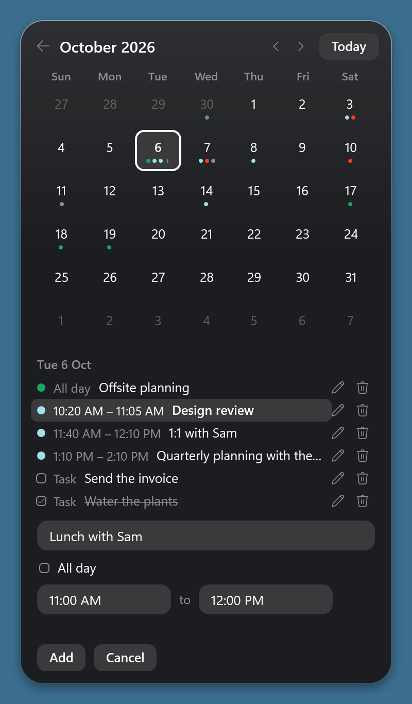 | 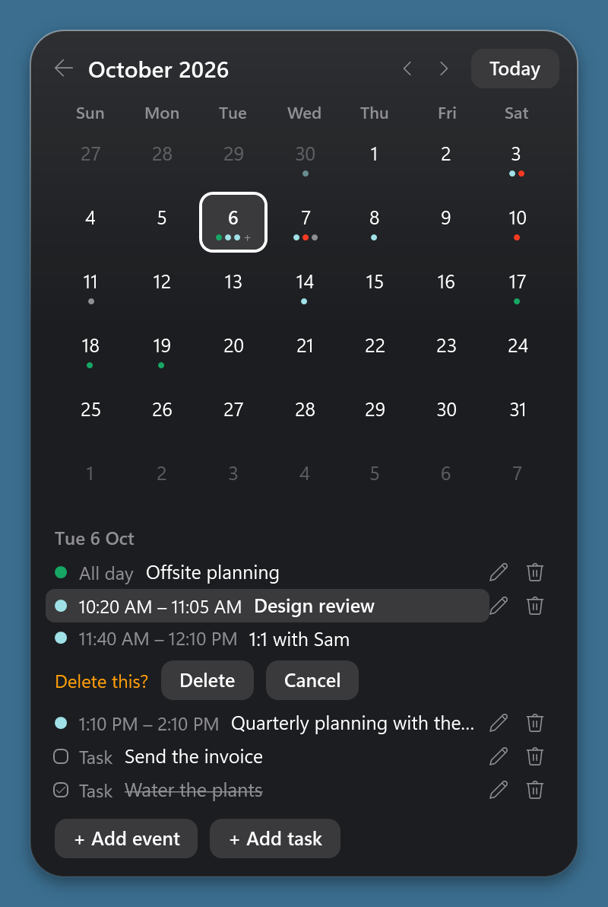 |

- **The month:** six weeks of days, with a dot for each event in its calendar's colour, and a grey one for a task.
  A small **+** means there are more than three. ‹ and › change the month, **Today** comes back, and ← returns to
  the tiles.
- **A day:** click it for its events, all-day ones first, then its tasks. Tick a task to mark it done in Google
  Tasks; untick it to undo.
- **+ Add event:** a title, then **All day** or a start and end time on that day ("2:30 PM", "14:30" and "2pm" all
  work), and the calendar when you have more than one you can add to. It goes into Google Calendar.
- **+ Add task:** a title, and the list when you have more than one. It goes into Google Tasks, due that day.
- **Edit or delete:** hover one of your own events or tasks for a pencil and a bin at the right of its row.
  - The pencil opens the form filled in: change the title, and an event's times, then click **Save**. An event that
    spans several days can only be deleted from here.
  - The bin asks **Delete this?** on the row first. Nothing is deleted until you click **Delete**.
  - For a repeating event, both change only that day's one.
  - If the event has guests, Google emails them about the change, as Google Calendar does.
  - Events you were invited to, and ones in calendars you can only read (such as holidays), have no buttons.
- Adding, ticking, editing and deleting need your own client and a sign-in. With the calendar link, the page shows
  your events only.
- **Keys:**
  - **← →** move a day and **↑ ↓** a week.
  - **Page Up** and **Page Down** change the month.
  - In the form, **Enter** adds or saves and **Esc** cancels.
  - **Esc** also cancels a **Delete this?**.
  - With nothing to cancel, **Esc** closes the panel as usual.
- If the page says to turn on the Google Tasks API, your Cloud project doesn't have it on yet: enable **Google Tasks
  API** under **APIs & Services → Library** (step 2 of [your own client](#google-calendar)). Tasks show up at the next
  read.

### Ideas → Notion

Ideas go into a Notion database of your choice, one page per idea, with the idea as the page's title.
Any database works.

1. In Notion's developer portal, [app.notion.com/developers/connections](https://app.notion.com/developers/connections),
   click **New connection** (you need to be the workspace's owner). Name it Capsule, keep **API token**, and
   click **Create connection**.
   - On its **Configuration** tab, Capsule needs only **Read content** and **Insert content**: untick
     **Update content** and choose **No user information**.
   - The **API token** on that tab is the secret Capsule asks for. Copy it.
2. In Capsule, open the panel, click ⚙, paste the token as the secret and click **Save and test**. Capsule
   keeps the secret and asks for the database's link.
3. Open the database you want the ideas in (or make one), then **••• → Connections** and add Capsule.
   Notion shows what Capsule may do there: read and insert content. Copy the database's link with
   **••• → Copy link**.
4. Open the panel and ⚙ again, paste the link, and click **Save and test**. It shows the database's name
   when both work.

That is two trips on purpose: clicking away closes the panel, and a secret that was pasted but not saved
is gone when it does. Once saved, the secret stays, so the second **Save and test** needs only the link.

Until the setup is done, and whenever Notion can't be reached, your ideas wait in Capsule and go to Notion
as soon as they can, in the order you typed them. Click an idea in the panel to open it in Notion.

Capsule keeps every idea until Notion confirms it. An idea that can't be written to disk yet (another
program has the file open, say) stays in memory and is tried again every few seconds, and the Ideas tile
says so meanwhile; quitting before it is written would lose it. A queue file Capsule can't read is kept beside it as `ideas-queue.json.unreadable-<time>`, and its ideas aren't sent until it's restored. Very rarely an idea reaches Notion twice,
for example when Notion made the page but its reply was lost, or Capsule quit while sending.

## What it reads, and where it connects

| Tool | Reads | Connects to |
|---|---|---|
| Claude | the Claude CLI's sign-in, `~/.claude/.credentials.json` | `api.anthropic.com/api/oauth/usage` |
| Codex | Codex's sign-in, `~/.codex/auth.json` (or under `%CODEX_HOME%` if you set it), or the usage Codex writes to its session logs; and, to see whether a turn is running, the end of Codex's recent session logs | `chatgpt.com/backend-api/wham/usage` |
| Ideas | the Notion secret you saved in Capsule | `api.notion.com`, once you set it up |
| Updates (a downloaded Capsule only) | nothing | `api.github.com` (the latest release's version number, once a day) |
| Google Calendar | the calendar link, or the sign-in and client secret, you saved in Capsule | with the link: `calendar.google.com` (the calendar's file); signed in: `oauth2.googleapis.com` (sign-in, renewing it, sign-out), `www.googleapis.com` (your calendar list and events, and adding, changing or deleting one) and `tasks.googleapis.com` (your tasks, and adding, ticking, renaming or deleting one) |

Those are the only eight places it connects to. Your browser handles Google's sign-in page,
`accounts.google.com`: Capsule only opens it there. Capsule doesn't follow redirects, so a request can't end up
anywhere else.
- Sign-in tokens stay in memory. They are never logged, shown or saved.
- The update check asks GitHub only for the newest release's version number, without any sign-in, and sends nothing
  about you. A Capsule you built yourself never checks; you update it with `git pull`.
- The Notion secret is stored encrypted for your Windows account (DPAPI), and only ever sent to Notion. It
  is never logged or shown, not even in the settings once saved.
- Notion is asked for only three things: the database's name and title column, adding an idea, and your
  five newest ideas.
- **Google Calendar.** With the secret link, Capsule only reads your calendar. Signed in, it reads your events, your
  list of calendars and your tasks due in the days shown. It changes something only when you ask on the month page:
  it adds the event or task you typed, ticks the task you clicked, or changes or deletes the event or task whose pencil
  or bin you clicked. It never touches events you were invited to.
  - **The secret link** is encrypted for your Windows account (DPAPI). It's only ever sent to `calendar.google.com`,
    and is never logged or shown, not even in the settings once saved.
  - **Kept encrypted:** the sign-in (a refresh token) and the client secret are encrypted for your Windows account
    (DPAPI). They're only ever sent to `oauth2.googleapis.com`, and are never logged or shown.
  - **Memory only:** the short-lived access tokens.
  - **Shown only, never logged or saved:** your events' and tasks' titles, and your calendars' and task lists' names.
    The events and tasks stay in memory. What you type into the month page's forms goes only to Google.
  - **The log:** counts and statuses only, such as "calendar: 7 events from 2 calendars".
  - **`config.json`:** your client's ID, and the ids of the calendars whose box you changed.
  - **The sign-in's return:** to come back from the browser, Capsule listens on `127.0.0.1` (this PC only) at a
    free port. It listens for one sign-in at a time, takes only the reply meant for that sign-in, and stops
    listening once it has it, or after 5 minutes.
- Ideas' text is never written to the log; only counts and statuses are. It is kept in `ideas-queue.json`
  while an idea waits, in `ideas-discarded.json` if you discard one, and in Notion.
- It reads the end of Codex's recent session logs every couple of seconds, only to find where a turn starts
  and ends, and scans Codex's day folders every 15 seconds for logs written recently. Nothing from those
  files is kept, shown or logged.
- It reads `~/.claude/settings.json` every 5 seconds to see whether its hook is connected. It changes that
  file only when you choose Connect, Reconnect or Disconnect.
- When Claude Code asks for a permission, the hook hands the request to Capsule over a local pipe that only
  your Windows account can open, and waits up to 90 s for your answer.
  - Complete supported commands, and its questions and your answers, are shown on the card only. They
    are held in memory, and never logged or saved.
  - **Always allow** applies exactly the rule Claude Code suggested, as the app's own button does. Capsule
    writes no permission rules itself.
- For each session, the hook records:
  - its id and state, and when that state began;
  - the name of the last event, and when it happened;
  - the project folder's name;
  - while Claude waits on you, a short reason, such as "needs permission: Bash" or up to 80 characters of
    Claude Code's own notification.

  It never records your prompts or anything Claude reads or writes.
- When Claude's sign-in is about to expire, Capsule runs `claude -p` with no input. That renews it without
  starting a conversation.
- Capsule's own files are in `%USERPROFILE%\.capsule\`:
  - its settings (`config.json`);
  - the last readings, and session status files;
  - the encrypted Notion secret (`notion-secret.bin`);
  - the encrypted Google calendar link, sign-in and client secret (`google-calendar-link.bin`, `google-token.bin`,
    `google-client-secret.bin`);
  - ideas waiting for Notion (`ideas-queue.json`), and ideas you discarded after Notion refused them
    (`ideas-discarded.json`);
  - a log.
- They're deliberately not under AppData. The Claude desktop app runs Claude Code, and so the hook, inside
  a Windows app package, and Windows redirects AppData writes from inside a package to a private copy that
  Capsule couldn't see.

## Uninstall

1. Menu → **Disconnect from Claude Code**, if you connected it.
2. Menu → untick **Start with Windows**, then **Quit Capsule**.
3. Delete Capsule's folder (where you unzipped it, or this repo's folder if you built it) and
   `%USERPROFILE%\.capsule\`.
4. Optionally, delete the backups Connect and Disconnect left next to Claude Code's settings:
   `~/.claude/settings.json.capsule-bak-*`. Older ones may be named `usage-notch-bak-*`.
5. If you set up Ideas, delete the Capsule connection in Notion's developer portal.
6. If you connected Google Calendar:
   - With the link: **Remove link** in the settings. Optionally, **Reset** the secret address in Google Calendar's
     **Integrate calendar**, so the old link stops working.
   - Signed in: choose **Sign out** in the settings first, which revokes Capsule's access.
   - Optionally, delete the Capsule project in the Google Cloud console.
   - While Capsule has access, your Google Account lists it under **Security → Your connections to third-party apps & services**.

## License

MIT: see [LICENSE](LICENSE). You may use, change and share Capsule, keeping the copyright notice.

## Credits

The provider marks are from [@lobehub/icons](https://github.com/lobehub/lobe-icons) (MIT). They are
trademarks of Anthropic and OpenAI.

Capsule was called UsageNotch until 2026-10-01.
